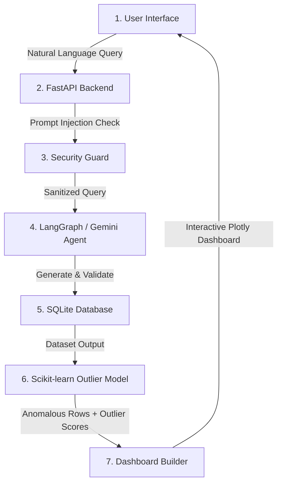
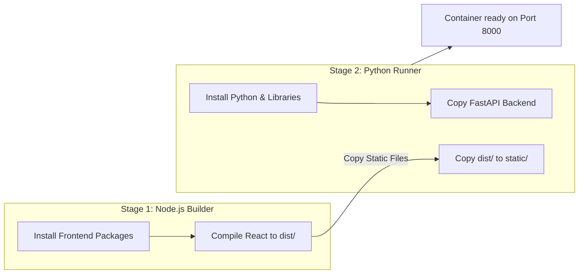
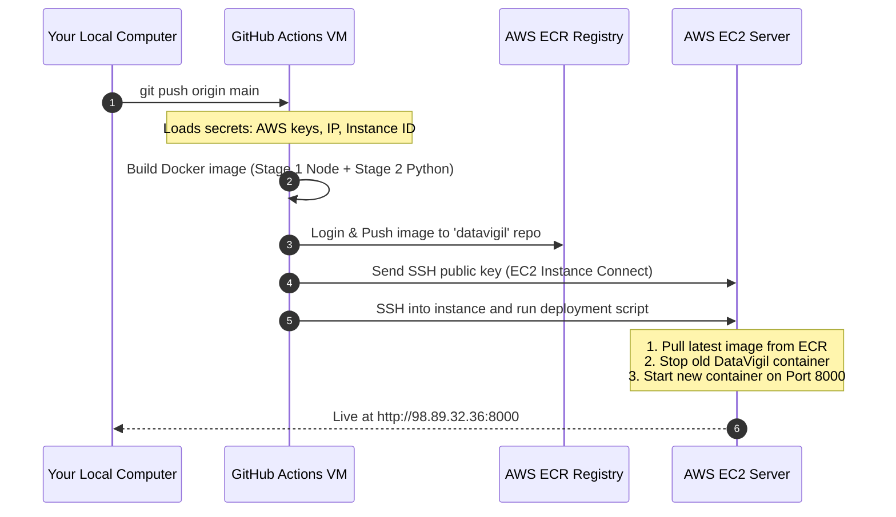

# DataVigil: MLOps and Deployment Guide

This document provides a beginner-friendly explanation of how the **DataVigil** application works, how it is packaged using Docker, and how it is deployed automatically to AWS using GitHub Actions.

---

## 1. How DataVigil Works (The Application Flow)

DataVigil is an autonomous business intelligence supervisor. It takes natural language questions from a user (e.g., *"Find anomalies in sales"*), translates them to SQL queries, executes them on a database, detects statistical outliers (anomalies), and plots the results.

### The System Architecture Flow:


---

## 2. Code Structure

DataVigil is structured as a React web application (frontend) connected to a Python FastAPI microservice (backend).

```text
DataVigil/
├── backend/
│   ├── main.py          # FastAPI application entrypoint
│   ├── config.py        # Environment variables & API key loader
│   ├── agents/          # LangGraph SQL generation loop & prompts
│   ├── database/        # SQLite connection & database seeding
│   ├── security/        # HuggingFace prompt classifier & SQL sanitizer
│   └── Dockerfile       # Unified multi-stage container blueprint
└── frontend/            # React + TypeScript single-page application (SPA)
```

---

## 3. The Docker Blueprint (How We Containerize)

We use a **Multi-Stage Dockerfile** located at `backend/Dockerfile` to package the entire application on port `8000`:



### Why we do this:
* **Single Port Utility:** By copying the built React files directly into the Python container, FastAPI can serve both the API backend and the static UI pages on a single port (`8000`). This avoids having to run Nginx separately.
* **Portability:** You do not need to compile code on the server. The runner starts instantly.

---

## 4. The GitHub Actions CD Pipeline (Continuous Deployment)

When you run `git push origin main`, GitHub starts a temporary virtual machine to execute the assembly line defined in `.github/workflows/deploy.yml`:



---

## 5. AWS Cloud Components

DataVigil relies on these core AWS services:
1. **AWS ECR (Elastic Container Registry):** A private cloud folder where your built Docker image is stored.
2. **AWS EC2 (Elastic Compute Cloud):** A virtual server (`t3.micro`) running Ubuntu 22.04 that downloads and hosts the Docker container.
3. **AWS Security Group:** An inbound firewall rule configured to open **Port 8000** (so you can view the dashboard UI) and **Port 22** (for secure SSH management).
4. **AWS S3 (Simple Storage Service):** Used by the application to persist reports and backups in the cloud.
