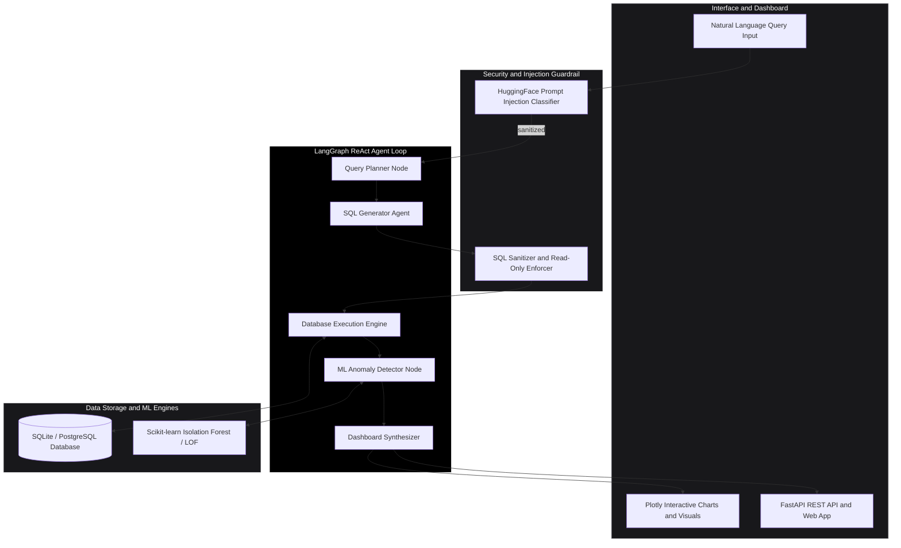
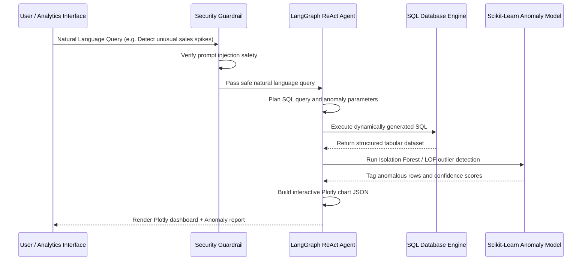

# DataVigil -- Autonomous ReAct Data Intelligence and Anomaly Detection Agent

DataVigil is an autonomous **ReAct Data Agent** built with **LangGraph**, **SQLite**, **Scikit-learn**, and **Plotly**. It converts natural language business queries into verified SQL statements, executes ML anomaly detection pipelines (Isolation Forest and Local Outlier Factor), and generates interactive real-time visual dashboards -- guarded by HuggingFace prompt injection protection.

---

## Architecture Topology



---

## Autonomous ReAct Execution Sequence Diagram



---

## Core Capabilities and Security Features

- **Natural Language to SQL**: Converts complex business questions into ANSI SQL queries with schema validation.
- **Machine Learning Anomaly Detection**: Unsupervised Isolation Forest and Local Outlier Factor (LOF) models identify outliers in temporal and multi-variate business metrics.
- **Prompt Injection Protection**: HuggingFace classifier and SQL AST parser block destructive statements (DROP, DELETE, UPDATE) and jailbreak attempts.
- **Interactive Visualization**: Generates Plotly JSON chart specifications directly rendered in frontend dashboards.

---

## Directory Structure

```
DataVigil/
|-- docker-compose.yml          # Container orchestration (Backend + Frontend)
|-- README.md                   # ASCII Architecture and User Documentation
|-- backend/
|   |-- Dockerfile              # Python FastAPI & Scikit-learn container
|   |-- requirements.txt        # FastAPI, LangGraph, Scikit-Learn, Plotly dependencies
|   |-- main.py                 # FastAPI server entry point
|   |-- config.py               # Environment & database settings
|   |-- agents/                 # ReAct agent implementation & prompt templates
|   |-- database/               # SQL engine & schema inspector
|   |-- security/               # Prompt injection classifier & SQL sanitizer
|   `-- tests/                  # Pytest unit & integration tests
`-- frontend/                   # Dashboard Web UI
```

---

## Quick Start Guide

### Prerequisites
- Python 3.10+
- SQLite or PostgreSQL database instance
- Docker and Docker Compose (Optional)

### Running Locally

1. **Clone Repository**:
   ```bash
   git clone https://github.com/siddarth1872004/DataVigil.git
   cd DataVigil
   ```

2. **Setup Backend**:
   ```bash
   cd backend
   pip install -r requirements.txt
   ```

3. **Start Server**:
   ```bash
   uvicorn main:app --reload --port 8000
   ```

4. **Access Dashboard API**:
   Navigate to `http://localhost:8000/docs`.

---

## License

Distributed under the **MIT License**. See `LICENSE` for details.
