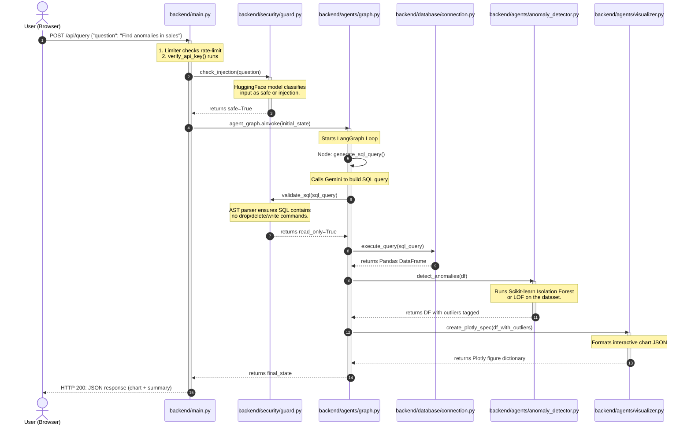

# DataVigil: Tech Stack and Code Flow Guide

This document breaks down the technology stack and code execution flow for **DataVigil** in detail.

---

## 1. The Technology Stack

DataVigil is composed of a decoupled frontend-backend architecture integrated with Machine Learning and AI agents:

```
[ Frontend: React/Vite ] ──HTTP/REST──> [ Backend: FastAPI ]
                                               │
                                 ┌─────────────┴─────────────┐
                                 ▼                           ▼
                       [ Security Guardrails ]     [ LangGraph Swarm Agent ]
                         - HuggingFace Model         - SQL Generation Loop
                         - Read-Only AST SQL         - Scikit-learn (ML Anomalies)
                                                     - Plotly Dashboard JSON
```

### Core Technologies Used:
* **FastAPI (Python):** The high-performance, asynchronous web server framework used for the API endpoints.
* **React 18 & TypeScript (Vite):** The single-page app (SPA) dashboard that lets users type prompts and view interactive Outlier charts.
* **LangGraph & LangChain:** LangGraph manages the state machine (the query planning, execution, and correction steps) using `gemini-1.5-flash` via LangChain.
* **SQLite (database):** A lightweight SQL engine embedded locally to store the demo business datasets (sales trends, temperature sensors).
* **Scikit-learn (Machine Learning):** Runs outlier algorithms (Isolation Forest and Local Outlier Factor) to identify anomalies in SQL outputs.
* **Plotly:** Converts anomaly data into interactive graphs (Plotly JSON), which are rendered dynamically in the React frontend.
* **HuggingFace Prompt Classifier:** A security model that evaluates user input to block prompt injections.

---

## 2. Code Execution Flow (Function-by-Function)

Here is exactly how a request propagates through the code:



---

## 3. Key Files and Imports Directory Map

To trace the code, follow these files in order:
1. **`backend/main.py`**
   * *Entrypoint:* Defines the `run_query` endpoint.
   * *Imports:* `agents.graph.agent_graph` to start the LangGraph loops.
2. **`backend/security/guard.py`**
   * *Function:* `verify_safety` uses the HuggingFace model wrapper to scan inputs.
3. **`backend/agents/graph.py`**
   * *Function:* `build_graph` hooks up nodes: `generate_sql_query`, `execute_query_node`, `anomaly_detector_node`, and `visualizer_node`.
4. **`backend/agents/anomaly_detector.py`**
   * *Function:* `anomaly_detector_node` prepares data, trains a temporary Isolation Forest model, and tags the dataset rows with Outlier flags.
